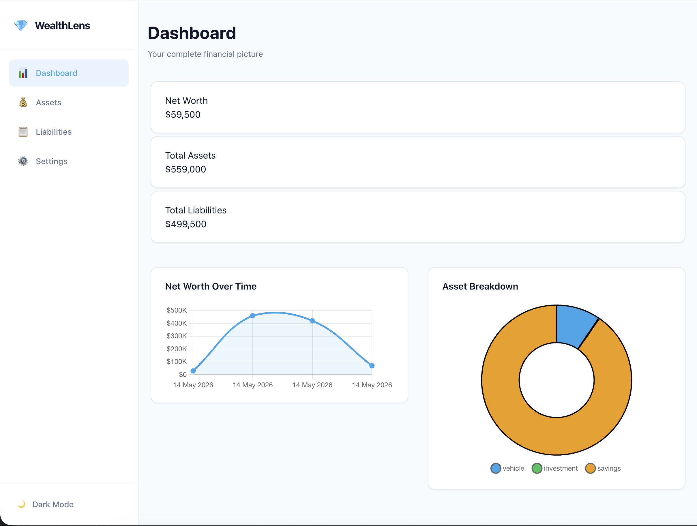
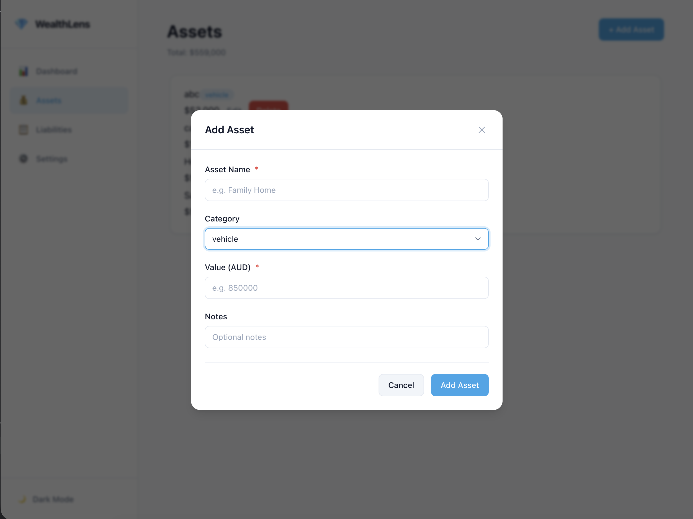
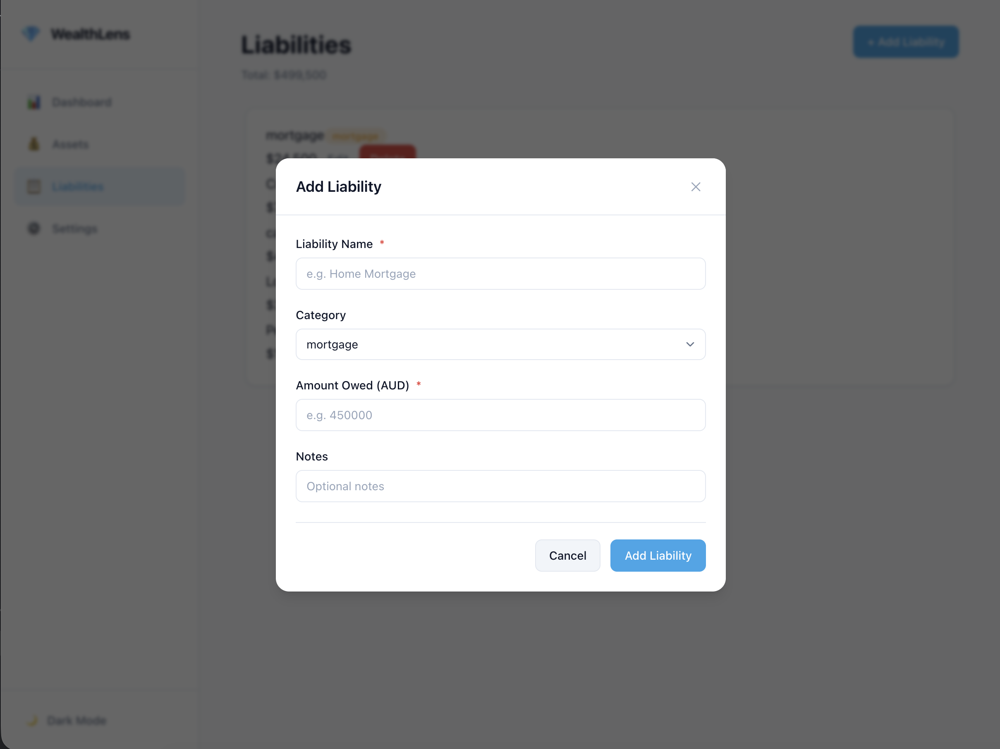
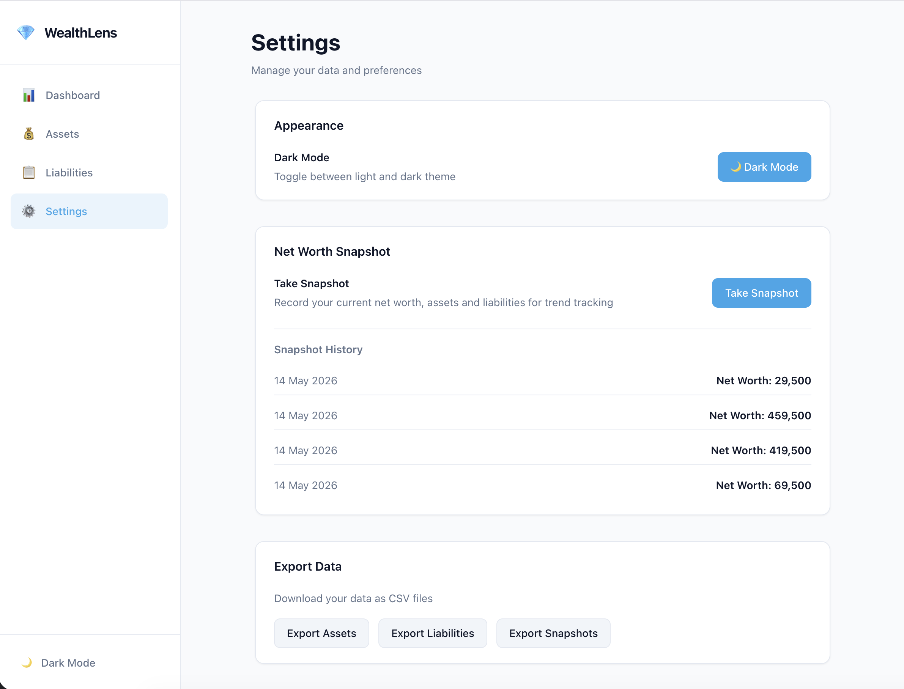
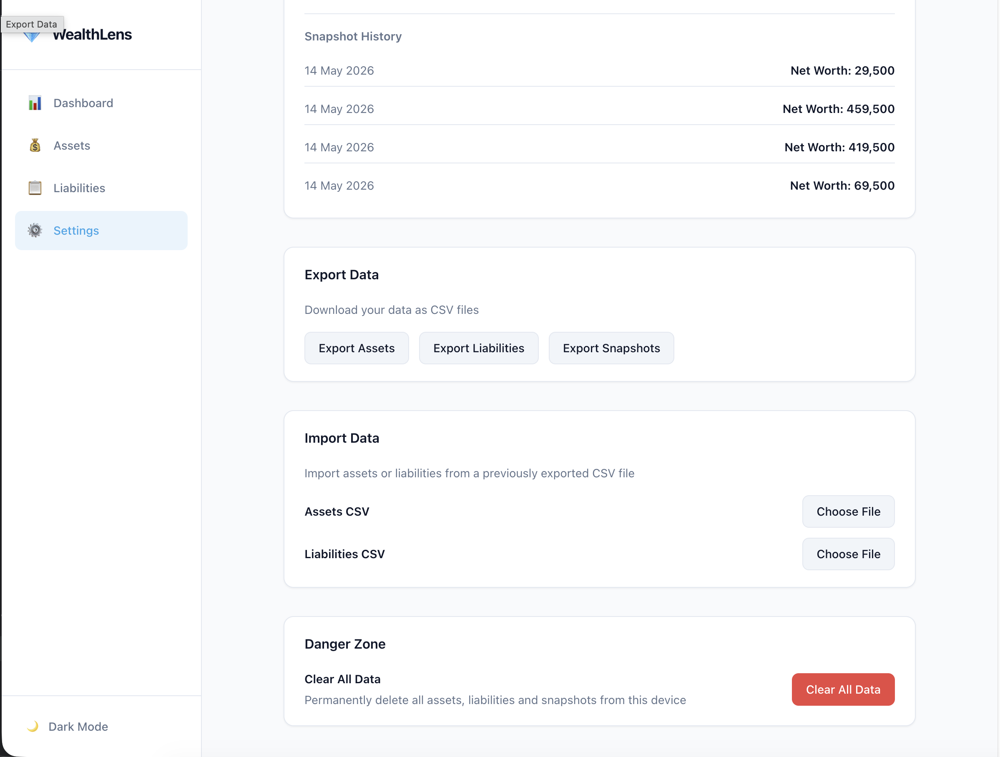
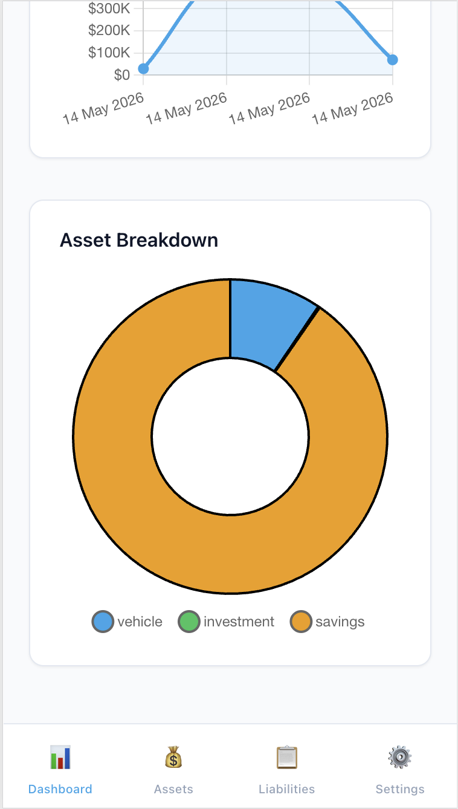

# 💎 WealthLens

A privacy-first net worth tracker built for Australians. All data lives in your browser — no account, no backend, no cloud.



---

## Features

- **Net worth tracking** — assets minus liabilities, calculated in real time
- **Asset management** — property, savings, superannuation, vehicle, investment, other
- **Liability management** — mortgage, personal loan, car loan, credit card, HECS, other
- **Net worth over time** — area chart built from manual snapshots
- **Asset breakdown** — doughnut chart by category
- **CSV export and import** — full data portability
- **Dark mode** — system preference detected, manual override persisted
- **PWA** — installable, works offline
- **AUD focused** — all values formatted with `en-AU` locale

---

## Screenshots

| Dashboard                                          | Assets                                          | Liabilities                                              |
| -------------------------------------------------- | ----------------------------------------------- | -------------------------------------------------------- |
|  |  |  |

| Settings                                         | Settings(contd.)                                   | Mobile                                       |
| ------------------------------------------------ | -------------------------------------------------- | -------------------------------------------- |
|  |  |  |

---

## Tech Stack

| Concern    | Choice                                          |
| ---------- | ----------------------------------------------- |
| Framework  | Angular 21 — standalone, zoneless               |
| Language   | TypeScript strict mode                          |
| State      | Signals — `signal()`, `computed()`, `effect()`  |
| Forms      | Angular Signal Forms (experimental)             |
| Styling    | Tailwind CSS v4 + CSS custom properties         |
| Charting   | Chart.js + ng2-charts                           |
| CSV        | PapaParse                                       |
| Testing    | Vitest                                          |
| Linting    | angular-eslint + typescript-eslint              |
| Formatting | Prettier                                        |
| Git hooks  | Husky + lint-staged + Commitlint                |
| PWA        | @angular/pwa + Angular Service Worker           |
| Storage    | Abstract class DI + LocalStorage implementation |

---

## Architecture

### Folder structure

```aiexclude

src/
├── app/
│   ├── components/         # Reusable UI — Button, Card, Modal, AppInput, Badge
│   ├── features/
│   │   ├── dashboard/      # Net worth summary, charts
│   │   ├── assets/         # Asset list, add, edit, delete
│   │   ├── liabilities/    # Liability list, add, edit, delete
│   │   └── settings/       # Export, import, snapshot, theme, clear
│   ├── layout/
│   │   └── shell/          # Sidebar + mobile bottom nav
│   ├── services/
│   │   ├── storage.service.ts        # Abstract StorageService
│   │   ├── local-storage.service.ts  # LocalStorage implementation
│   │   ├── wealth.service.ts         # Signal-based state
│   │   └── theme.service.ts          # Dark mode
│   ├── tokens/             # InjectionTokens for config and storage keys
│   ├── types/              # TypeScript interfaces and types
│   └── utils/              # Pure functions — formatters, calculations, csv
└── public/
├── manifest.webmanifest
└── icons/
```

### Design principles

- **SOLID** — single responsibility per service, open for extension via DI
- **Program to abstractions** — `StorageService` abstract class, swap implementations without touching components
- **Signals-first** — no RxJS in application code, all state via `signal()` and `computed()`
- **OnPush everywhere** — all components use `ChangeDetectionStrategy.OnPush`
- **No any** — TypeScript strict mode enforced throughout
- **Accessible** — proper labels, ARIA attributes, keyboard navigation

### Storage abstraction

```typescript
// Swap LocalStorage for GoogleDrive by changing one line in app.config.ts
{
  provide: StorageService,
  useClass: LocalStorageService, // → GoogleDriveService
}
```

---

## Getting Started

### Prerequisites

- Node.js 22+
- npm 10+
- Angular CLI 21+

### Installation

```bash
git clone https://github.com/suhastgit/wealthlens.git
cd wealthlens
npm install
```

### Development

```bash
ng serve
```

Open `http://localhost:4200`

### Production build

```bash
ng build
```

Output in `dist/wealthlens/browser/`

### Tests

```bash
ng test
```

### Lint

```bash
ng lint
```

---

## Git workflow

```aiexclude
main          ← stable releases only
└── develop   ← integration branch
└── feature/N-name  ← one branch per feature
```

- Conventional Commits enforced via Commitlint
- Pre-commit: ESLint + Prettier via lint-staged
- Pre-push: blocks direct pushes to `main`
- `--no-ff` merges preserve branch history

---

## Data model

```typescript
interface Asset {
  id: string;
  name: string;
  category: 'property' | 'savings' | 'superannuation' | 'vehicle' | 'investment' | 'other';
  value: number;
  notes?: string;
  createdAt: string;
  updatedAt: string;
}

interface Liability {
  id: string;
  name: string;
  category: 'mortgage' | 'personal-loan' | 'car-loan' | 'credit-card' | 'hecs' | 'other';
  value: number;
  notes?: string;
  createdAt: string;
  updatedAt: string;
}

interface Snapshot {
  id: string;
  date: string;
  netWorth: number;
  totalAssets: number;
  totalLiabilities: number;
}
```

---

## Privacy

All data is stored exclusively in your browser's `localStorage`. Nothing is transmitted to any server. Clearing your browser data will erase your WealthLens data — use the CSV export in Settings to back up regularly.

---

## Future Features

- [ ] Google Drive sync adapter
- [ ] Multiple portfolios
- [ ] Target net worth goal tracking
- [ ] Recurring liability tracking (repayment schedules)
- [ ] Category-level budget alerts

---

## License

MIT
